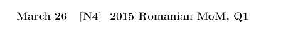

# MO Server

## What's MO Server?

MO Server is a Discord server dedicated to the discussion of Mathematical Olympiads. You can join the Discord server through the following invite link: https://discord.gg/m22vNrX. It's a growing community of competition math enthusiasts with over 500 members currently. You can learn more about our server and the features we offer at the bottom.  

At the moment, this GitHub repository hosts two categories of files: PoTD and Contests.  

### PoTDs

PoTD is an abbreviation for "Problem of the Day".  These are problems posted daily (~~mostly, we do forget sometimes~~) by the Problem Curators (they will have a Problem Curators role in the Discord server). These are quite varied in difficulty and content, ranging from easy beginner questions to ones which are as hard as IMO P3/6. 

#### Understanding PoTD Codes

Next to each problem name you'll see a 2 or 3 letter code. 

Here it is `N4`. The `N` represents the type of problem - `A` for Algebra, `C` for Combinatorics, `G` for Geometry, and `N` for Number Theory.  

The `4` represents the difficulty of the problem. Problems range from difficulty `1` (easy beginner problems which are almost trivial, as example being "Prove that there are no 1999 primes in an arithmetic progression that are all less than 12345.") to `5-6` (IMO P1/4) to `9-10` (IMO P3/6).  

So there are a wide variety of problems available here. 

### Contests

Contests are server-run contests. These run every month (usually on the first or second weekend of each month). They alternate between beginner (months which are 1 mod 3), intermediate (months which are 2 mod 3), advanced (months which are 0 mod 3). We have had 3 contests so far. Contests are named according to difficulty - beginner < intermediate < advanced. 

### More about MO Server

**Channels and Categories in this server**
In this server, we have the *General* category which is for general conversation. Note that #lounge is generally "for on-topic discussion of Olympiads or maths in general! For other things go to #chill."  
If you are an IMO participant or past participant, we have the *IMO* category to discuss IMO things.  
The *Contests* category is for discussion of olympiad mathematics. Please use the appropriate channel. 
*Challenges* are problems which the server moderators and problem curators post. These usually have a difficulty rating ranging from 1 (nearly trivial) to 5-6 (IMO P1/4) to 9-10 (IMO P3/6).  
*Reruns* are where we allow members to "sit" past contests such as the EGMO or IMO typically 2 days to a week after the contest has happened.  
*Server Contests* are contests which have been made by the server staff. There are 3 difficulties - Beginner, Intermediate, and Advanced which rotate each month.  
*Input Output* is a game where players input numbers and a bot will tell you the output from those inputs. Players win by being able to guess the function in the least number of inputs.  
*Tutorials* are sessions where some people teach others. They will run soon.  
*Livesolving* is where people stream themselves solving difficult olympiad problems for the first time. This is always entertaining to watch! 